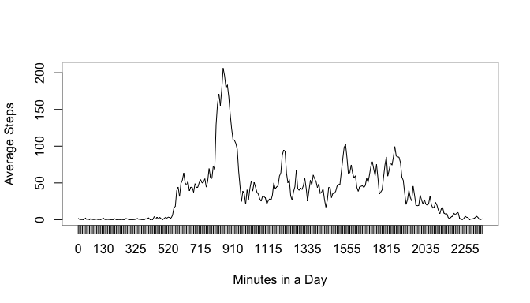
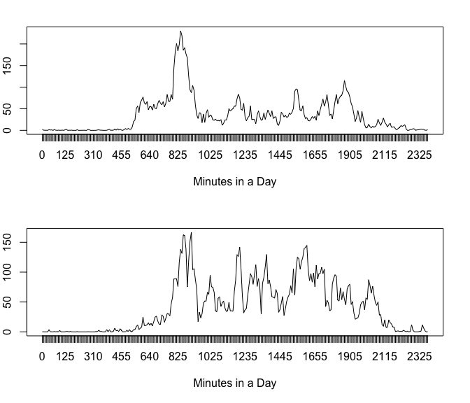

Ryan Tillis - Reproducible Research: Project 1 - Reproducible Research - Coursera
================
<a href="http://www.ryantillis.com"> Ryan Tillis </a>
10/30/2016

Mark Down for Peer Review
=========================

This an R markdown file generated for completion of the Coursera Reproducible Research Course Project 1. The following computations and visualizations are performed using the ggplot2, dplyr, and scales packages. <https://www.coursera.org/learn/reproducible-research/>.

What is mean total number of steps taken per day?
=================================================

The following code loads the file to a csv in the WD, converts date column to date datatype, and converts data set to a data frame.

``` r
activity <- read.csv("activity.csv")

activity$date <- as.Date(activity$date, "%Y-%m-%d")
activity <- as.data.frame(activity)
```

Plots a histogram for step total by day using ggplot2


Calculates mean and median of steps take by day

``` r
steps <- with(activity, tapply(steps, date, sum, na.rm = TRUE))

mean(steps)
```

    ## [1] 9354.23

``` r
median(steps)
```

    ## [1] 10395

What is the average daily activity pattern?
===========================================

Using tapply, the means for each interval here are calculated across days.

``` r
daymeans <- with(na.omit(activity), tapply(steps, interval, mean))
head(daymeans)
```

    ##         0         5        10        15        20        25 
    ## 1.7169811 0.3396226 0.1320755 0.1509434 0.0754717 2.0943396



This code uses a logical vector to select the maximum value for the mean steps across intervals. The 835th interval gives the maximum value.

``` r
daymeans[which(daymeans == max(daymeans))]
```

    ##      835 
    ## 206.1698

The following sums the na values and then reports the ratio of NA/total observations.

``` r
library(scales)
sum(is.na(activity))
```

    ## [1] 2304

``` r
percent(sum(is.na(activity))/nrow(activity))
```

    ## [1] "13.1%"

Imputing missing values
=======================

My strategy for replacing NAs is to replace each NA value by steps mean per interval. This is accomplished by using a nested for loop to identify the respective interval of the row then replace the NA value with the mean for that interval.

For demonstration purposes, the head and the tail of the data both contain NAs.

``` r
head(activity)
```

    ##   steps       date interval
    ## 1    NA 2012-10-01        0
    ## 2    NA 2012-10-01        5
    ## 3    NA 2012-10-01       10
    ## 4    NA 2012-10-01       15
    ## 5    NA 2012-10-01       20
    ## 6    NA 2012-10-01       25

``` r
tail(activity)
```

    ##       steps       date interval
    ## 17563    NA 2012-11-30     2330
    ## 17564    NA 2012-11-30     2335
    ## 17565    NA 2012-11-30     2340
    ## 17566    NA 2012-11-30     2345
    ## 17567    NA 2012-11-30     2350
    ## 17568    NA 2012-11-30     2355

The int and len variable are set up to manage the for loop sequences. The NAin and NA steps variables are sections of the data that will be used to replace the NA data after the loop.

``` r
int <- unique(activity$interval)
len <- nrow(activity[is.na(activity),])

NAint <-  activity[is.na(activity),3]
NAsteps <- activity[is.na(activity),1]

for (j in 1:2304) {
       for (i in 1:288){
              if (NAint[j] == int[i])
                     NAsteps[j] <- daymeans[i]
       
       }
}

NAindex <- is.na(activity$steps)
activity$steps<- replace(activity$steps,NAindex, NAsteps)
```

As can be seen here, the NAs have been replaced by the relevant mean for the 5 minute interval.

``` r
head(activity)
```

    ##       steps       date interval
    ## 1 1.7169811 2012-10-01        0
    ## 2 0.3396226 2012-10-01        5
    ## 3 0.1320755 2012-10-01       10
    ## 4 0.1509434 2012-10-01       15
    ## 5 0.0754717 2012-10-01       20
    ## 6 2.0943396 2012-10-01       25

``` r
tail(activity)
```

    ##           steps       date interval
    ## 17563 2.6037736 2012-11-30     2330
    ## 17564 4.6981132 2012-11-30     2335
    ## 17565 3.3018868 2012-11-30     2340
    ## 17566 0.6415094 2012-11-30     2345
    ## 17567 0.2264151 2012-11-30     2350
    ## 17568 1.0754717 2012-11-30     2355

Below is an histogram with the updated data.  Calculates mean and median of steps take by day

``` r
steps <- with(activity, tapply(steps, date, sum, na.rm = TRUE))

mean(steps)
```

    ## [1] 10766.19

``` r
median(steps)
```

    ## [1] 10766.19

Do these values differ from the estimates from the first part of the assignment? What is the impact of imputing missing data on the estimates of the total daily number of steps?

Yes they are changed, because the NAs were replaced based on the interval means, the mean and the median for the day now match up.

Are there differences in activity patterns between weekdays and weekends?
=========================================================================

First, this code creates a new factor variable.

``` r
library(dplyr)
```

    ## 
    ## Attaching package: 'dplyr'

    ## The following objects are masked from 'package:stats':
    ## 
    ##     filter, lag

    ## The following objects are masked from 'package:base':
    ## 
    ##     intersect, setdiff, setequal, union

``` r
activity <- mutate(activity, day = weekdays(activity$date))

weekdays <- c('Monday', 'Tuesday', 'Wednesday', 'Thursday', 'Friday')

activity$day <- factor((weekdays(activity$date) %in% weekdays), 
         levels=c(FALSE, TRUE), labels=c('Weekend', 'Weekday'))
```

``` r
weekdays <- subset(activity, day == "Weekday")
weekends <- subset(activity, day == "Weekend")

weekendmeans <- with(weekends, tapply(steps, interval, mean))
weekdaymeans <- with(weekdays, tapply(steps, interval, mean))
```


