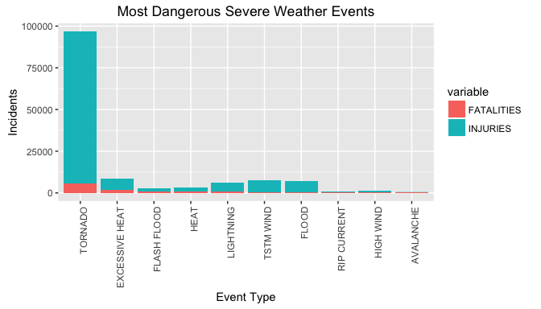

Analyzing the Impact of Severe Weather Events
================
<a href="http://www.ryantillis.com"> Ryan Tillis </a>
August 9, 2016

Introduction
------------

Storms and other severe weather events regularly cause public health disasters and economic hardships. These events often result in fatalities, injuries, and property damage.

This analysis is a brief exploration of the U.S. National Oceanic and Atmospheric Administration's (NOAA) storm database. This database tracks when and where events occur along with estimated impacts. The data can be found here: <https://d396qusza40orc.cloudfront.net/repdata%2Fdata%2FStormData.csv.bz2>.

The primary goal of this analysis is to answer the following two questions: 1. Across the United States, which types of events (as indicated in the 𝙴𝚅𝚃𝚈𝙿𝙴 variable) are most harmful with respect to population health? 2. Across the United States, which types of events have the greatest economic consequences?

### Loading the data and relevant packages

The first step is to load the data. In this analysis I chose to use the Plyr and reshape2 packages for data processing. For plotting I used ggplot2.

``` r
storm <- read.csv(bzfile("Storm.csv.bz2"))
library(plyr)
library(reshape2)
library(ggplot2)
```

Data Processing
---------------

Using fatalities and injuries the data was aggregated using the plyr package. Sorting by fatalities first then injuries and eliminating event without documented damage to human population.

### Health Impact Aggregation

This segment of code selects the relevant data columns, aggregates fatalities and injuries then sorts and selects the top 10.

``` r
##Selects the columns which include type of disaster, fatality and injury counts.
storm_h <- storm[,c(8,23:24)]

##Aggregates the sums for fatalities and injuries by event type and sorts by fatality count then by injury count (highest first).
health_agg <- ddply(storm_h, .(EVTYPE), colwise(sum))
health_agg <- arrange(health_agg, -FATALITIES, -INJURIES)

##Considers only the top 10 most damaging events to human populations.
top10 <- health_agg[1:10,]
```

### Economic Impact Aggregation

This segment of code selects the relevant data columns, aggregates property damage and crop damage and then selects the top 25.

``` r
##Selects the columns with type of disaster, property damage and crop damage.
storm_e <- storm[,c(8,25,27)]

##Aggregates damage amounts by event type.
econ_agg <- ddply(storm_e, .(EVTYPE), colwise(sum))
econ_agg <- arrange(econ_agg, -PROPDMG, -CROPDMG)

##Selects 25 event types with highest damage amounts
top25 <- econ_agg[1:25,]
```

### Health Impact Reformatting

The primary objective of this code is to create useful factors for graphing. The first portion deals with injury/fatality factorization. The 2nd segment assigns an order to the 10 most dangerous events.

``` r
##Reformats the data, which allows use of the injury/fatality distinction as a factor rather than a column. Done using the reshape2 package.
top10p <- melt(top10, id.vars = "EVTYPE")

##Orders the factors by total fatalities
top10p$EVTYPE <- factor(top10p$EVTYPE, levels = top10p$EVTYPE[order(c(1:10))])
```

### Economic Impact Reformatting

The primary objective of this code is to create useful factors for graphing. The first portion deals with property/crop damage factorization. The 2nd segment assigns an order to the 25 most dangerous events.

``` r
#Reformats data to allow factorization
top25p <- melt(top25, id.vars = "EVTYPE")

##Orders factors by property damage totals
top25p$EVTYPE <- factor(top25p$EVTYPE, levels = top25p$EVTYPE[order(c(1:25))])
```

Results
-------

This section briefly presents the most dangerous and costly severe weather events based on the data set.

### Most Dangerous Disasters

The following graph shows the 10 most dangerous disasters in terms of injuries and fatalities. The graph is ordered from left to right starting with the highest fatality rate.



### Most Costly Disasters

The following graph shows the 25 most costly disasters in terms of property and crop damage. The graph is ordered from left to rate starting with the most property damage.


### Conclusion

Based on these results we can conclusively state that **tornadoes are bad**. <http://www.ryantillis.com/>
