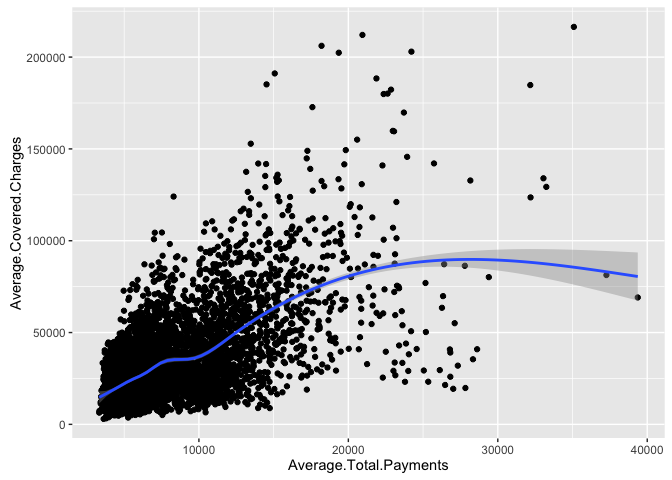
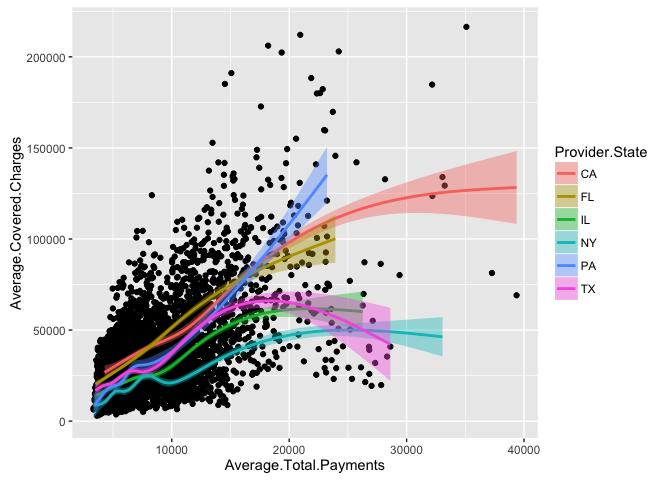
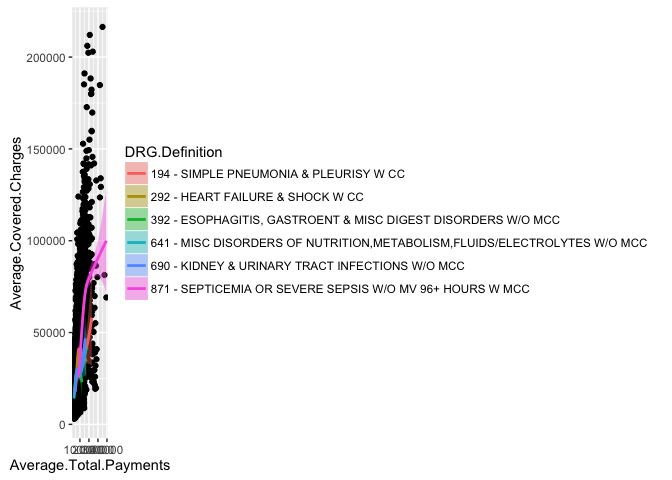

Ryan Tillis - Project 1 - Reproducible Research - Coursera
================
<a href="http://www.ryantillis.com"> Ryan Tillis </a>
10/27/2016

Exploratory Graphing - Global Active Power
------------------------------------------

You will be looking at a subset of a United States medical expenditures dataset with information on costs for different medical conditions and in different areas of the country.

You should do the following:

Make a plot that answers the question: what is the relationship between mean covered charges (Average.Covered.Charges) and mean total payments (Average.Total.Payments) in New York? Make a plot (possibly multi-panel) that answers the question: how does the relationship between mean covered charges (Average.Covered.Charges) and mean total payments (Average.Total.Payments) vary by medical condition (DRG.Definition) and the state in which care was received (Provider.State)?

``` r
download <- download.file("https://d18ky98rnyall9.cloudfront.net/_e143dff6e844c7af8da2a4e71d7c054d_payments.csv?Expires=1477785600&Signature=Bt~7TUHJAZWMzAjg6cMaQDvRWHhKjOEYWo-tNlLFOtwxOeO2g~mitUM1R9SGe371rHFU3HbgIFJFps772qmMaB2MoPEh9-fBub~Y59KtZd4h40~kkGXeltDL5FzEKprFQmtk~cNvll3cRd-0M-KR-sebeijKeU2K0IuHQ4PLts0_&Key-Pair-Id=APKAJLTNE6QMUY6HBC5A",destfile = "temp")

data <- read.csv("temp")

unlink("temp")
head(data)
```

    ##                           DRG.Definition Provider.Id
    ## 1 194 - SIMPLE PNEUMONIA & PLEURISY W CC       50242
    ## 2 194 - SIMPLE PNEUMONIA & PLEURISY W CC      100061
    ## 3 194 - SIMPLE PNEUMONIA & PLEURISY W CC      100062
    ## 4 194 - SIMPLE PNEUMONIA & PLEURISY W CC      100181
    ## 5 194 - SIMPLE PNEUMONIA & PLEURISY W CC      100183
    ## 6 194 - SIMPLE PNEUMONIA & PLEURISY W CC      100187
    ##                    Provider.Name Provider.Street.Address Provider.City
    ## 1             DOMINICAN HOSPITAL       1555 SOQUEL DRIVE    SANTA CRUZ
    ## 2             MERCY HOSPITAL INC        3663 S MIAMI AVE         MIAMI
    ## 3 MUNROE REGIONAL MEDICAL CENTER         1500 SW 1ST AVE         OCALA
    ## 4      LARKIN COMMUNITY HOSPITAL        7031 SW 62ND AVE   SOUTH MIAMI
    ## 5          CORAL GABLES HOSPITAL         3100 DOUGLAS RD  CORAL GABLES
    ## 6      PALMETTO GENERAL HOSPITAL          2001 W 68TH ST       HIALEAH
    ##   Provider.State Provider.Zip.Code Hospital.Referral.Region.Description
    ## 1             CA             95065                      CA - Santa Cruz
    ## 2             FL             33133                           FL - Miami
    ## 3             FL             34474                           FL - Ocala
    ## 4             FL             33143                           FL - Miami
    ## 5             FL             33134                           FL - Miami
    ## 6             FL             33016                           FL - Miami
    ##   Total.Discharges Average.Covered.Charges Average.Total.Payments
    ## 1               96                60386.84                9175.01
    ## 2               32                33432.12                7389.15
    ## 3               96                25886.77                5419.63
    ## 4               74                39932.79                8326.00
    ## 5               35                74303.31                8241.82
    ## 6               54                65354.05                8504.90
    ##   Average.Medicare.Payments
    ## 1                   8250.46
    ## 2                   6414.65
    ## 3                   4542.18
    ## 4                   7615.60
    ## 5                   7097.31
    ## 6                   7773.37

``` r
library(ggplot2)
```

``` r
g <- ggplot(data, aes(x=Average.Total.Payments,y=Average.Covered.Charges))+geom_point()+stat_smooth()
g
```



``` r
g2 <- ggplot(data, aes(x=Average.Total.Payments,y=Average.Covered.Charges, group=Provider.State))+geom_point()+stat_smooth(aes(colour=Provider.State,fill=Provider.State))
g2
```



``` r
g3 <- ggplot(data, aes(x=Average.Total.Payments,y=Average.Covered.Charges, group=DRG.Definition))+geom_point()+stat_smooth(aes(colour=DRG.Definition,fill=DRG.Definition))
g3
```



``` r
g4 <- ggplot(data, aes(x=Average.Total.Payments,y=Average.Covered.Charges, group=DRG.Definition))+geom_point()+stat_smooth(aes(colour=DRG.Definition,fill=DRG.Definition))+facet_grid(. ~ Provider.State)
```

<hr>
See more at <a href="http://www.ryantillis.com"> my website. </a>

<hr>
